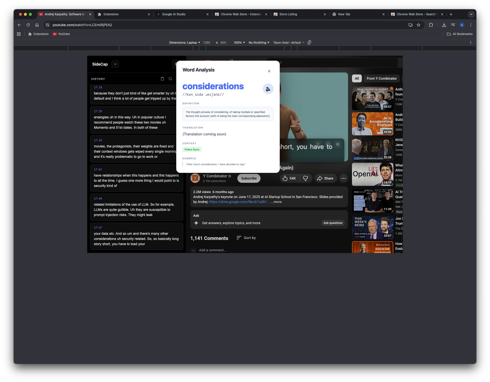
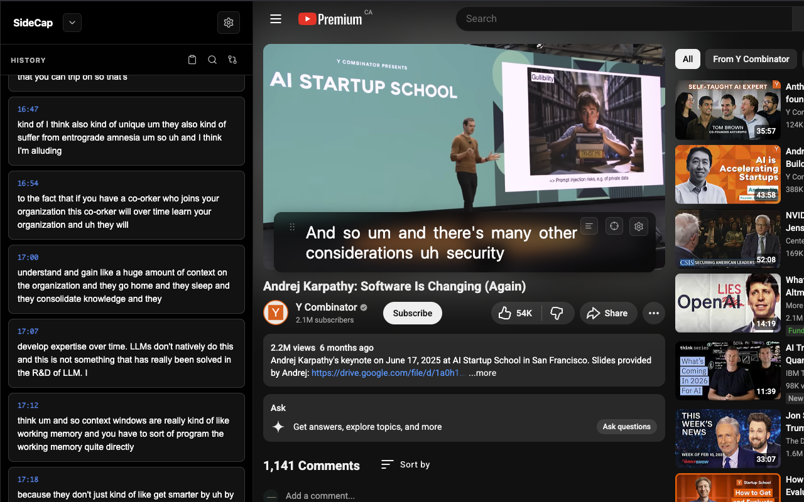
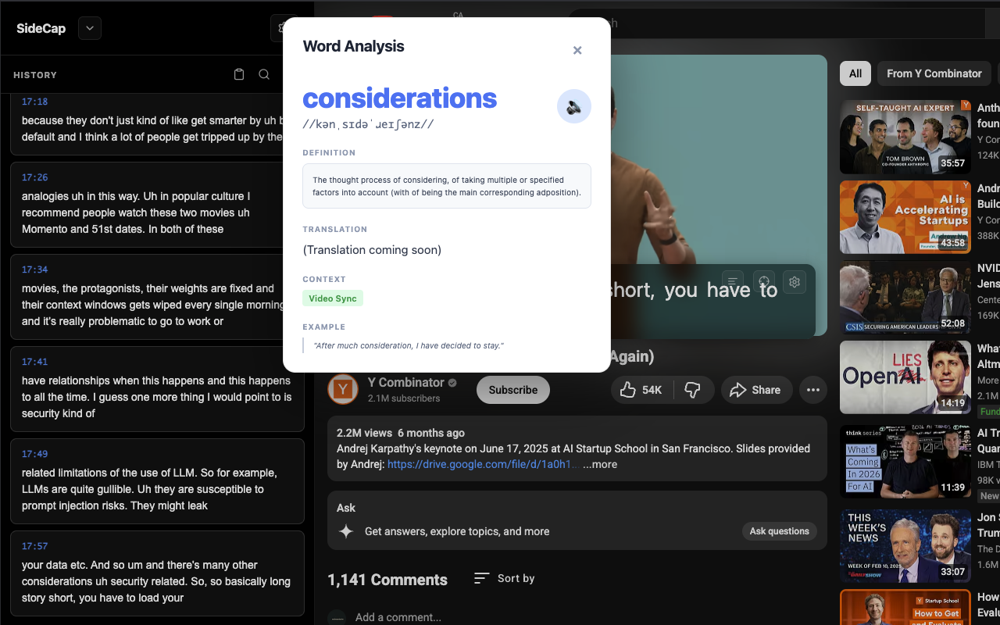
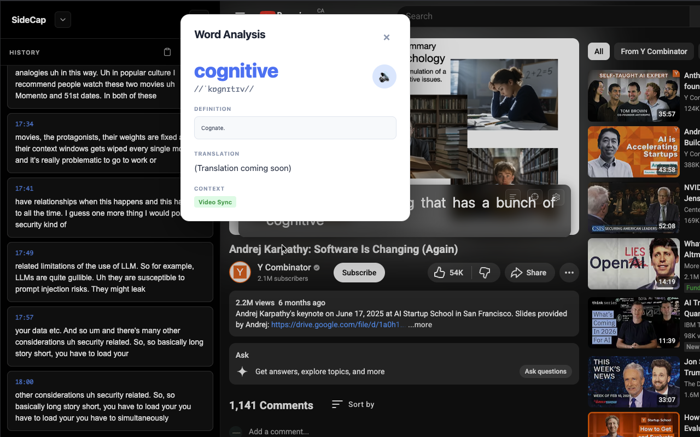

# SideCap

Learn languages faster with interactive YouTube captions - word lookup, translations, and clean transcripts in a beautiful sidebar.

## Features

- **Interactive Captions** - Click any word to see definitions, translations, and examples
- **Dual Subtitles** - On-demand translation for caption history
- **Beautiful Sidebar** - Clean transcript history with timestamps
- **Word Lookup** - Dictionary definitions with phonetics and pronunciation
- **Light/Dark Themes** - Frosted glass UI that matches your preference
- **Customizable** - Adjust fonts, colors, opacity, and more

## Screenshots

| Sidebar | Word Popup | Settings |
|---------|------------|----------|
|  |  |  |

## Installation

1. Download the latest release (`sidecap-v0.5.0.zip`)
2. Unzip the file
3. Open Chrome and go to `chrome://extensions`
4. Enable "Developer mode" (top right)
5. Click "Load unpacked" and select the unzipped folder
6. Go to YouTube and enjoy!

## Usage

1. **Open any YouTube video** with captions enabled
2. **Click the "C" button** (top-left) to open the sidebar
3. **Click any word** in the caption overlay to look it up
4. **Translate history items** by clicking the translate icon
5. **Customize** via the settings gear icon

## Settings

- **Mode**: Learning (definitions) or Translation (quick translate)
- **Theme**: Dark or Light with glassmorphism effects
- **Appearance**: Font size, family, colors, opacity
- **Language**: Set caption language and translation target

## Tech Stack

- Vanilla JavaScript (no frameworks)
- Chrome Extension Manifest V3
- [Free Dictionary API](https://dictionaryapi.dev/)
- [Lingva Translate](https://github.com/thedaviddelta/lingva-translate)

## License

MIT
